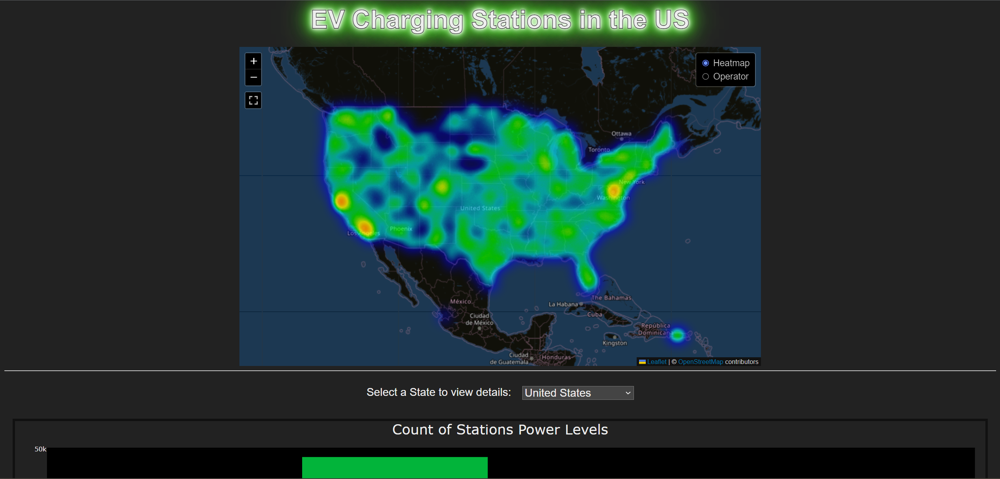

# Project 3 -  Electric Vehicle Charging Stations

We gathered electric vehicle charging station data from OpenChargeMap and used it to create a PostgreSQL database, a Flask API, and a dashboard web page with a variety of maps and graphs.

## Team Members
- Charles Sisemseghan
- Emmanuel Montano
- Kali Schoenrock
- Stephanie Gutierrez
- Sydney Salinas
- Zachary Aaronson

## Data
Our data was collected from [OpenChargeMap](https://openchargemap.org/site/develop/api#/) for all locations in the United States. Additional reference data was also downloaded using the API. The data was then cleaned using Python and Pandas the exported to CSV and JSON files. The code to do this can be found in [`fetch_and_process_data.ipynb`](/fetch_and_process_data.ipynb), though you will need an API key from OpenChargeMap stored in `api_keys.py`.

OpenChargeMap collects their data mostly from crowd sourcing and data imports from public or open data [[Source]](https://openchargemap.org/site/about). Due to the crowd sourcing, data is likely to have some inaccuracies due to inconsistent data entry or missing data.

## DataBase
A PostgreSQL database was created using [`charging_db.sql`](/postgresql/charging_db.sql) and the CSV files in `data/` to hold the charging station data along with the reference data.

Steps to Use:
1. Run the `CREATE TABLE` and `ALTER TABLE` queries from [`charging_db.sql`](/postgresql/charging_db.sql).
2. In pgadmin, use the import tool to import the csv files to the correct table
    - import `reduced_data.csv` for the `stations` table last.
    - Do NOT include the "ID" column when importing into `stations`.
3. Run the test `SELECT` queries at the bottom of the sql file.

## Flask API
A Flask API was created to showcase retrieving our data from an API. Github pages only runs for static pages so Python and Flask can't be used directly with our website.

Steps to Use:
1. First create the SQLite database using [`Create_sqlite.py`](/flaskAPI/Create_sqlite.py)
    - `reduced_data.sqlite` should be created in the data/ folder
2. Run the flask app with [`flask_app.py`](/flaskAPI/flask_app.py)
3. Go to your localhost with the correct port number in your browser to access the API.
    - State names are two characters long (ex: TX)

## Website

The website has a leaflet map with two different layers. There are also three bar charts that can have their data filtered by state.

### [Link to Website](https://zachaa.github.io/EV_Charging_Stations/)

## Packages and Libraries
- Python
    - [GeoPy](https://geopy.readthedocs.io/en/stable/)
    - Pandas
    - Requests
    - SQLAlchemy
    - Flask
- JavaScript
    - D3.js
    - Plotly
    - Leaflet
        - [leaflet-fullscreen](https://github.com/brunob/leaflet.fullscreen)
- PostgreSQL
- SQLite
